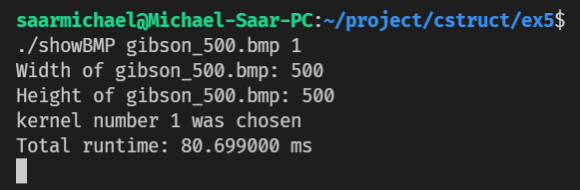
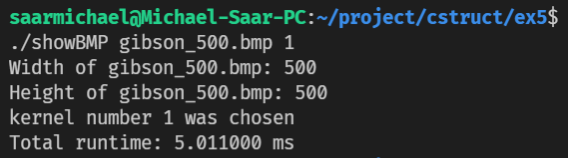

# optimization-contest

In this project I was given a very slow code and needed to improve its run time as much as possible.  
This was practically a contest between the whole class (about 250 students), when grades where given based on the improvement in running time compared to the original code.  
   
The first was taken after running the slow code, which took 80ms, and the last picture is the optimized code- 16 times faster!
### What is the code doing?
The file *myfunction.c* gets as the first parameter a *.bmp* file, which is a picture format where each pixel is represented by 3 bytes- Red, Green and Blue (RGB).
The second parameter is a number, defining what type of **filter** the function should apply on the given picture.  
### How does the slow Code work?
Let's dive in.  
I'll go through the general structure in order to later demonstrate the optimizations I made.
The basic data unit is the pixel: 
```
typedef struct {  
    unsigned char red;  
    unsigned char green;  
    unsigned char blue;  
} pixel;
```  
Let's recall that the Image data is a rwo-dimentional array of bytes, every three consecutive bytes rpresent one pixel.
Therfore, the first operation is converting the array of bytes to an array of *pixel*s.
The next step is iterating over the imgae and for each pixel, **applying a filter**, evntually changing the value of all pixels. By doing so, a new image is recived and it is a filtered version of the original image.
**Applying a filter:** each pixel and its eight surrounding pixels form a nine-pixel-square. Based on the option given as a command line argument (1 or 2), the function makes several calculatios over the nine-pixel-square.  
Here is an **example of the inefficiency** of the slow code:
Notice the use of a nested loop when working on exactly 9 pixels each iteration.
Also, notice the excessive function calls, when these functions do very basic calculations.
```
static pixel applyKernel(int dim, int i, int j, pixel *src, int kernelSize, int kernel[kernelSize][kernelSize], int kernelScale, bool filter) {
	int ii, jj;
	int currRow, currCol;
	pixel_sum sum;
	pixel current_pixel;
	int min_intensity = 766; // arbitrary value that is higher than maximum possible intensity, which is 255*3=765
	int max_intensity = -1; // arbitrary value that is lower than minimum possible intensity, which is 0
	int min_row, min_col, max_row, max_col;
	pixel loop_pixel;
	initialize_pixel_sum(&sum);
	int istart = max(i-1, 0);
	int istop = min(i+1, dim-1);
	for(ii = istart; ii <= istop; ii++) {
		for(jj = max(j-1, 0); jj <= min(j+1, dim-1); jj++) {
			int kRow, kCol;
			// compute row index in kernel
			if (ii < i) {
				kRow = 0;
			} else if (ii > i) {
				kRow = 2;
			} else {
				kRow = 1;
			}
			// compute column index in kernel
			if (jj < j) {
				kCol = 0;
			} else if (jj > j) {
				kCol = 2;
			} else {
				kCol = 1;
			}
			// apply kernel on pixel at [ii,jj]
			sum_pixels_by_weight(&sum, src[calcIndex(ii, jj, dim)], kernel[kRow][kCol]);
		}
	}
  ```
This is only a small example, the whole code is fluded with this style of functions.  
### How did I optimized the code?  
The first thing that bothered me looking at the slow code, was the conversion of the byte array to *pixel*s array.
Using the *pixel* struct is obviously more convenient for writing code, but its need for conversion costs valuable time, so I decided to work directly with the original array of bytes.  
Before moving on, I used the __*gprof*__ profiler in order to detect which function consumes most of the run time, and found out that this function is *applyKernel* (the function above).  
Putting it all together, I used nine pointers, representing the nine-pixel-square:  
```
  register unsigned char* a = src;
	register unsigned char* x = src + 3;
	register unsigned char* u = src + 6;
	register unsigned char* b = src + dim;
	register unsigned char* y = src + dim + 3;
	register unsigned char* v = src + dim + 6;
	register unsigned char* c = src + dim + dim;
	register unsigned char* z = src + dim + dim + 3;
	register unsigned char* w = src + dim + dim + 6;
```
While it's not very convenient, it has major advanteges:
- the pointer arithmetic is super fast since the pointers are held in registers. In the slow code each access to memory was depending on an index-calculation, which takes a lot of time.
- the spatial locality of my code is very high resulting faster access to memory- once a byte in memory is accessed, the access to the following bytes is very fast becuase they are all cached with the first byte
-  


